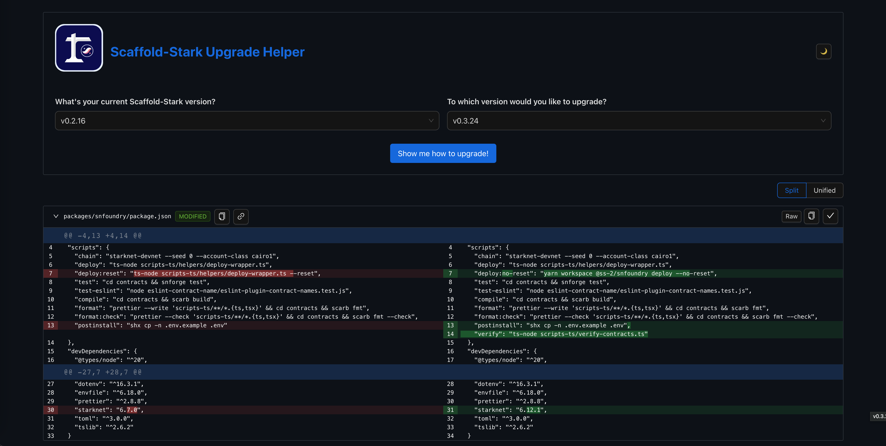

<p align="center">
  
</p>

<h1 align="center">Upgrade Helper</h1>

<p align="center">
  A web tool to help you upgrade your Scaffold-Stark/scaffold-stark-2 dapp with ease! 🚀
</p>



## Run locally

```bash
yarn
yarn start
```

## 📝 License & CoC

This project is released under the [MIT license](./LICENSE).

## Acknowledgments

Special thanks to [upgrade-helper](https://github.com/react-native-community/upgrade-helper), which provided the foundation for this project.
